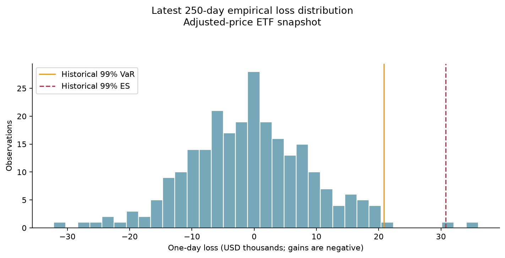
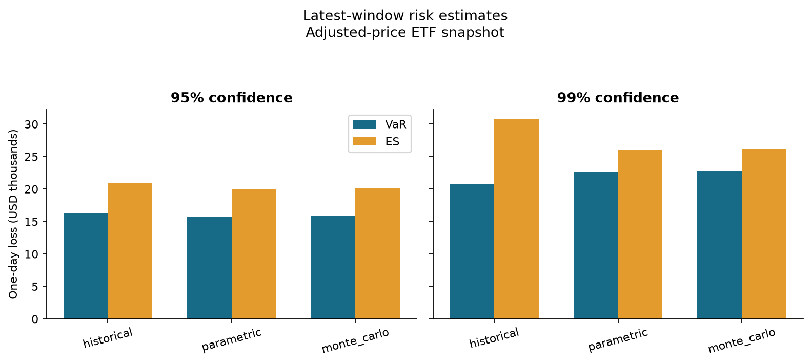
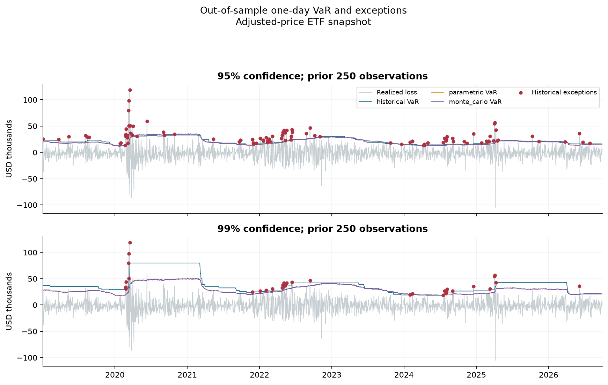
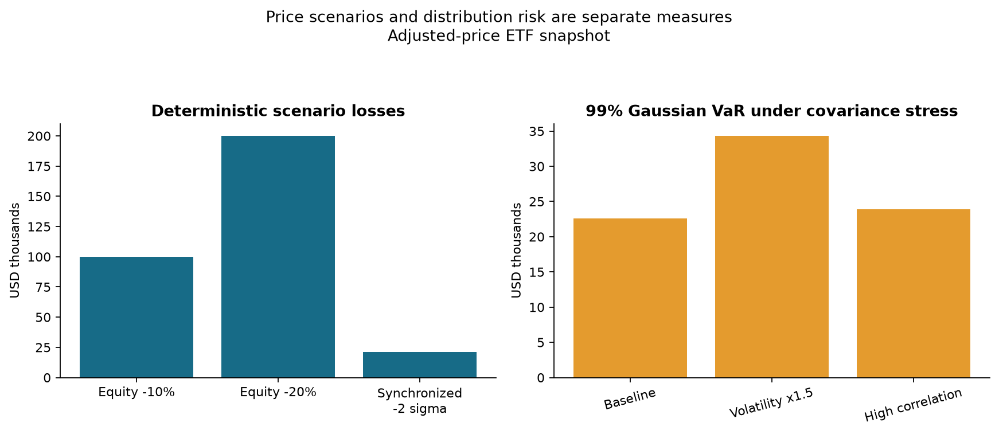
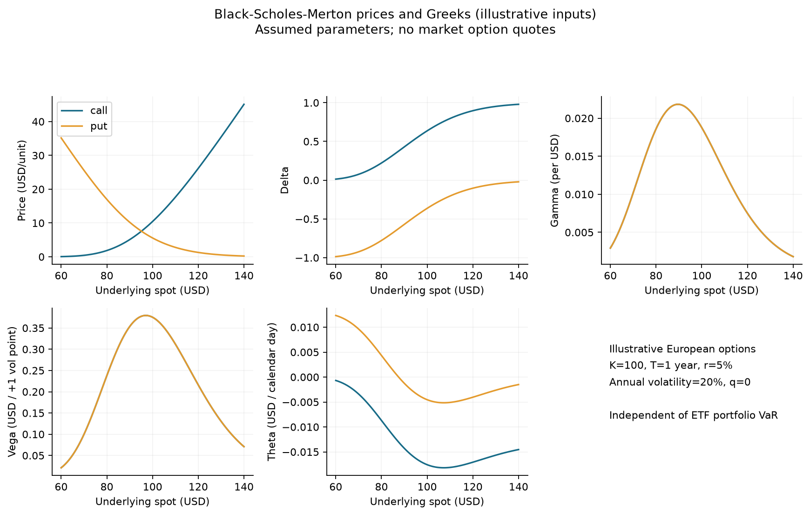
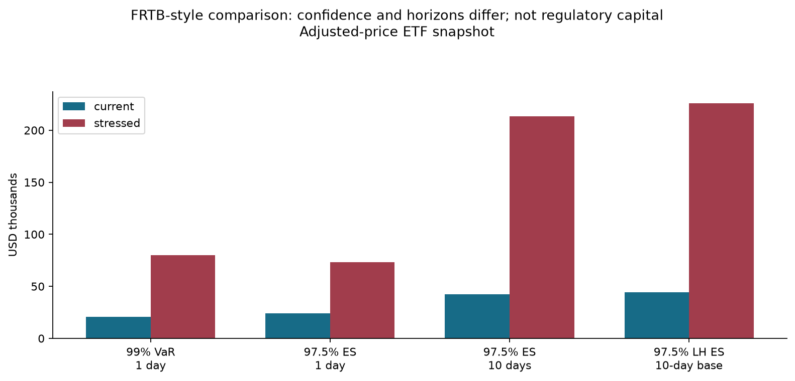

# MarketRiskLab - generated case study

**Data: Yahoo Finance adjusted prices via yfinance.**

Price period: 2018-01-02 to 2026-09-30; 2,198 prices and 2,197 returns. Reference exposure: USD 1,000,000; weights: [0.4, 0.35, 0.25].

## Latest-window VaR and ES

| method | confidence | var_usd | es_usd | calibration_start | calibration_end |
| --- | --- | --- | --- | --- | --- |
| historical | 0.95 | 16223.4 | 20917.4 | 2025-10-02 | 2026-09-30 |
| parametric | 0.95 | 15791.5 | 19987.4 | 2025-10-02 | 2026-09-30 |
| monte_carlo | 0.95 | 15808 | 20096.9 | 2025-10-02 | 2026-09-30 |
| historical | 0.99 | 20812 | 30738.7 | 2025-10-02 | 2026-09-30 |
| parametric | 0.99 | 22634.7 | 26037.4 | 2025-10-02 | 2026-09-30 |
| monte_carlo | 0.99 | 22804.3 | 26181.9 | 2025-10-02 | 2026-09-30 |

## Out-of-sample validation

Each model has 1,947 forecasts from 2019-01-02 to 2026-09-30. Every forecast uses the preceding 250 observations; the realized return is excluded.

| method | confidence | forecasts | exceptions | exception_rate | kupiec_p_value | independence_p_value | conditional_coverage_p_value |
| --- | --- | --- | --- | --- | --- | --- | --- |
| historical | 0.95 | 1947 | 95 | 0.048793 | 0.80622 | 0.000621053 | 0.00277811 |
| historical | 0.99 | 1947 | 32 | 0.0164355 | 0.00901053 | 0.000112477 | 1.90628e-05 |
| monte_carlo | 0.95 | 1947 | 102 | 0.0523883 | 0.63126 | 0.00078031 | 0.0031545 |
| monte_carlo | 0.99 | 1947 | 49 | 0.0251669 | 1.67118e-08 | 0.00780042 | 3.53321e-09 |
| parametric | 0.95 | 1947 | 102 | 0.0523883 | 0.63126 | 0.00078031 | 0.0031545 |
| parametric | 0.99 | 1947 | 48 | 0.0246533 | 4.34797e-08 | 0.00644601 | 7.52945e-09 |

Historical 95% VaR has 95 exceptions (4.88%; expected 5%). Kupiec does not reject at 5% significance (p=0.80622); independence rejects (p=0.000621053).

Historical 99% VaR has 32 exceptions (1.64%; expected 1%). Kupiec rejects (p=0.00901053). Gaussian 99% VaR has 48 exceptions (2.47%); Kupiec rejects (p=4.34797e-08).

A rejection is a sample-specific model diagnostic. Failure to reject does not prove accuracy. These tests cannot establish the cause of a breach or distinguish every source of model error.

### Latest 250 forecasts

| method | confidence | forecasts | exceptions | exception_rate | kupiec_p_value | independence_p_value |
| --- | --- | --- | --- | --- | --- | --- |
| historical | 0.95 | 250 | 6 | 0.024 | 0.0366057 | 0.586195 |
| historical | 0.99 | 250 | 1 | 0.004 | 0.278071 | 0.928444 |
| monte_carlo | 0.95 | 250 | 7 | 0.028 | 0.0828066 | 0.524511 |
| monte_carlo | 0.99 | 250 | 2 | 0.008 | 0.741933 | 0.857177 |
| parametric | 0.95 | 250 | 6 | 0.024 | 0.0366057 | 0.586195 |
| parametric | 0.99 | 250 | 2 | 0.008 | 0.741933 | 0.857177 |

### Largest realized losses that breached historical 99% VaR

| date | realized_loss_usd | var_usd | exceedance_usd |
| --- | --- | --- | --- |
| 2020-03-16 00:00:00 | 118863 | 50644 | 68218.5 |
| 2020-03-12 00:00:00 | 97988.3 | 44293.3 | 53695 |
| 2020-03-09 00:00:00 | 79857.7 | 31901.2 | 47956.5 |
| 2025-04-04 00:00:00 | 56307.4 | 30506.8 | 25800.6 |
| 2025-04-03 00:00:00 | 54498.1 | 30126.5 | 24371.6 |

## Stress and derivatives

| scenario | confidence | deterministic_loss_usd | var_usd | es_usd |
| --- | --- | --- | --- | --- |
| baseline | 0.95 | unavailable | 15791.5 | 19987.4 |
| baseline | 0.99 | unavailable | 22634.7 | 26037.4 |
| volatility_x1.5 | 0.95 | unavailable | 24049.9 | 30343.7 |
| volatility_x1.5 | 0.99 | unavailable | 34314.6 | 39418.7 |
| high_correlation | 0.95 | unavailable | 16672.5 | 21092.2 |
| high_correlation | 0.99 | unavailable | 23880.7 | 27464.9 |
| equity_minus10pct | unavailable | 100000 | unavailable | unavailable |
| equity_minus20pct | unavailable | 200000 | unavailable | unavailable |
| synchronized_minus2sigma | unavailable | 21269.8 | unavailable | unavailable |

Blank measures are unavailable by design: deterministic losses are not confidence-level VaR estimates.

Options use illustrative inputs rather than market quotes; they are excluded from ETF VaR and capital calculations.

| kind | price | delta | gamma | vega | theta |
| --- | --- | --- | --- | --- | --- |
| call | 10.4506 | 0.636831 | 0.018762 | 0.37524 | -0.0175727 |
| put | 5.57353 | -0.363169 | 0.018762 | 0.37524 | -0.00454214 |

| kind | scenario | full_repricing_loss_usd | approximation_error_usd |
| --- | --- | --- | --- |
| call | zero_shock | -0 | 0 |
| call | equity_minus10pct | 535.936 | -7.08442 |
| call | equity_minus20pct | 859.116 | -39.3046 |
| call | volatility_plus10points | -378.067 | -2.82677 |
| call | equity_minus20pct_vol_plus10points | 589.736 | 66.5558 |
| put | zero_shock | -0 | 0 |
| put | equity_minus10pct | -464.064 | -7.08442 |
| put | equity_minus20pct | -1140.88 | -39.3046 |
| put | volatility_plus10points | -378.067 | -2.82677 |
| put | equity_minus20pct_vol_plus10points | -1410.26 | 66.5558 |

## FRTB-style extension

Evaluated 1,948 candidate 250-observation windows. The selected window is 2019-05-31 to 2020-05-27. Current liquidity-adjusted ES is USD 44,534.49; stressed liquidity-adjusted ES and the illustrative capital proxy are USD 225,811.26.

The same 250-observation calibration produces 241 overlapping 10-day scenarios. The stressed window is selected retrospectively and is not used in historical VaR forecasts.

| calibration | start | end | var99_1day_usd | es975_1day_usd | es975_10day_usd | liquidity_adjusted_es975_usd |
| --- | --- | --- | --- | --- | --- | --- |
| current | 2025-10-02 | 2026-09-30 | 20812 | 24077 | 42152.2 | 44534.5 |
| stressed | 2019-05-31 | 2020-05-27 | 79857.7 | 73378 | 213508 | 225811 |

**This is not full FRTB or regulatory capital.** ETF liquidity mappings are educational proxies. There is no reduced-factor calibration, regulatory multiplier, NMRF, default-risk charge, desk eligibility or PLA assessment.

## Main limitations

- Historical tails are noisy: 99% ES on 250 observations uses only 2.5 observations' probability mass.

- Gaussian parametric and Monte Carlo share normality and constant-window volatility assumptions.

- Adjusted-price snapshots may be revised; this is not a point-in-time vendor archive.

- ETF exposures overlap; there is no look-through, intraday, transaction-cost, FX or liquidity-cost model.

- Constant reference exposures produce hypothetical losses, not an actual trading-account backtest.

- Overlapping 10-day scenarios are dependent; ES and retrospective stress selection have estimation uncertainty.

- Black-Scholes assumes European exercise, constant rates/volatility and continuous diffusion.

All numerical statements in this report come from the exported tables. See run_manifest.json for input checksum, source, versions and conventions.
